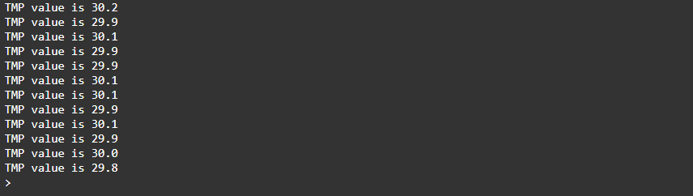

<div style = "font-family: 'Open Sans', sans-serif; font-size: 16px">

# ModuleThermoTMP36

<div style = "color: #555">
    <p align="center">
    
    </p>
</div>

## Лицензия

<div style = "color: #555">
В разработке
</div>

## Описание
<div style = "color: #555">

Модуль предназначен для работы с аналоговым датчиком температуры TMP36 в рамках фреймворка EcoLite. Разработан в соответствии с нотацией архитектуры датчиков и является потомком класса [ClassSensor](https://github.com/Konkery/ModuleSensorArchitecture/blob/main/README.md). Количество каналов - 1. 

</div>

## Конструктор
<div style = "color: #555">

Конструктор принимает данные из конфига. Пример ниже:
```json
"11": {
    "pins": ["A3"],
    "name": "TMP36",
    "article": "",
    "type": "sensor",
    "channelNames": ["position"],
    "typeInSignal": "analog",
    "typeOutSignal": "digital",
    "quantityChannel": 1,
    "busTypes": [],
    "manufacturingData": {}
}
```
</div>

### Поля
<div style = "color: #555">

- <mark style="background-color: lightblue">_Interval</mark> - поле для хранения ссылки на интервал опроса датчика.
</div>

### Методы
<div style = "color: #555">

- <mark style="background-color: lightblue">Start()</mark> - запускает циклический опрос измерительного канала датчика;
- <mark style="background-color: lightblue">Stop()</mark> - прекращает считывание значений с заданного канала;
</div>

### Возвращаемые данные
<div style = "color: #555">
Датчик возвращает значение температуры в градусах Цельсия. 

</div>

### Примеры
<div style = "color: #555">
Пример программы для вывода данных раз в одну секунду:

```js
//Создание объекта класса
let tmp = SensorManager.CreateDevice('11')[0];
// Запускаем опрос 
tmp.Start(300);

// Выводим в консоль значение если оно существенно обновилось

let interval = setInterval(() => {
    console.log(`TMP value is ${(tmp.Value).toFixed(1)}`);
}, 2000);
```
Результат выполнения:
<div align='left'>
    
</div>

</div>

### Зависимости
<div style = "color: #555">

</div>

</div>
